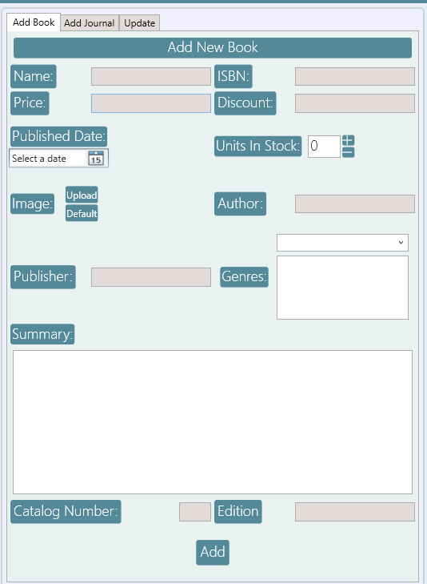
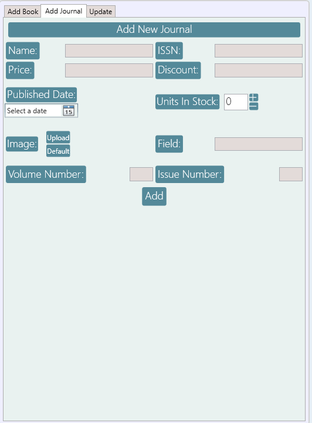
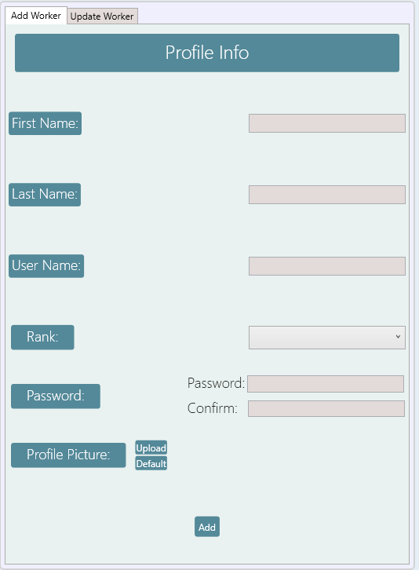
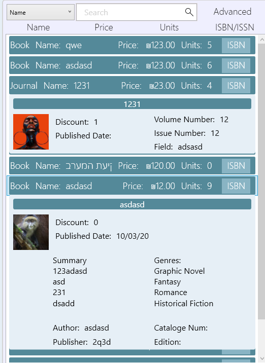
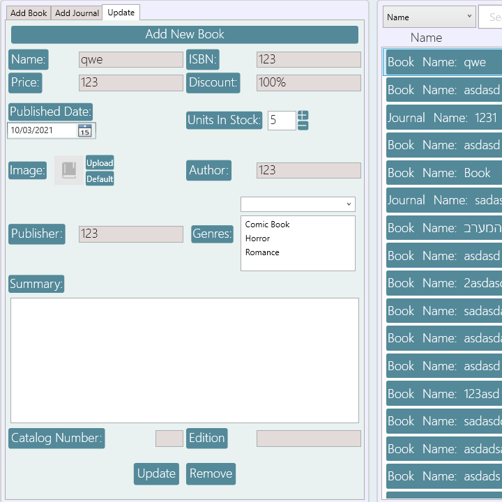
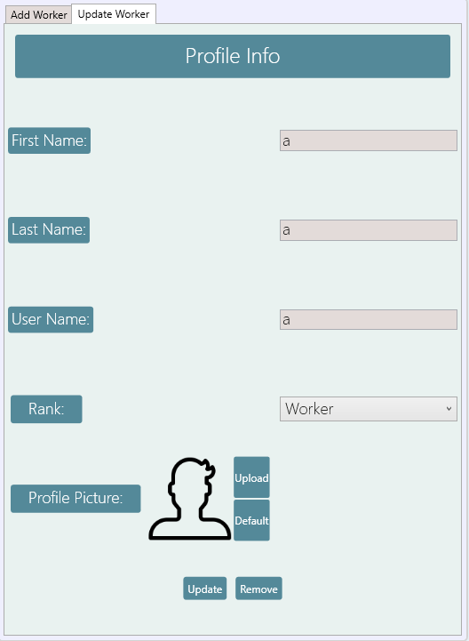
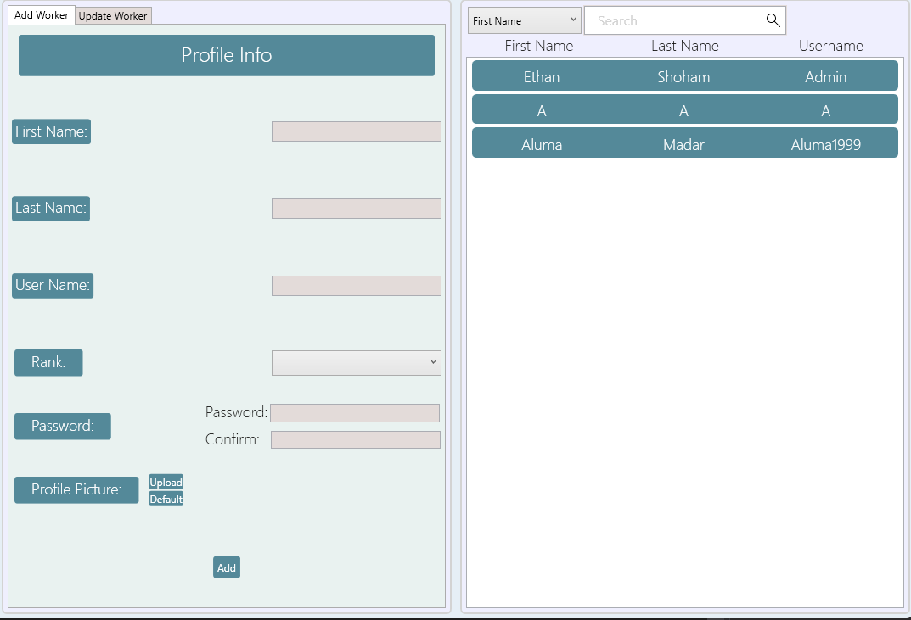

# Book Store Project WPF
### A C# Application Class Project

This is a inventory management system for a book store I made as part of my C# studies.
First WPF project I did.
Not my proudest project, but it shows the proggress I made.. 🙂

## Screenshots

  
  
 

## Technologies
 
### Architecture
- **Layered Architecture**

### Application
- **WPF**
- **.NET Framework 4.8**

# Author 📝

-   **Ethan Shoham** - [LinkedIn](https://www.linkedin.com/in/ethan-shoham-13a40050/)
